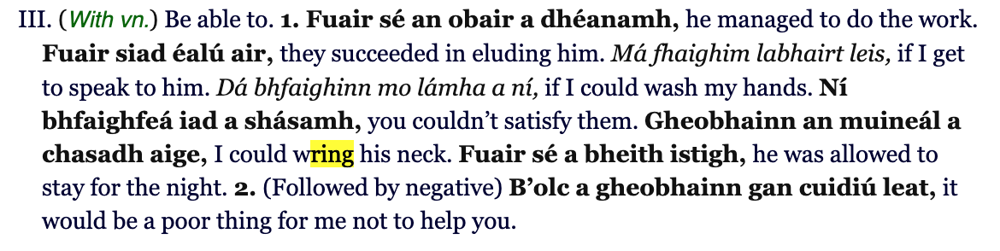
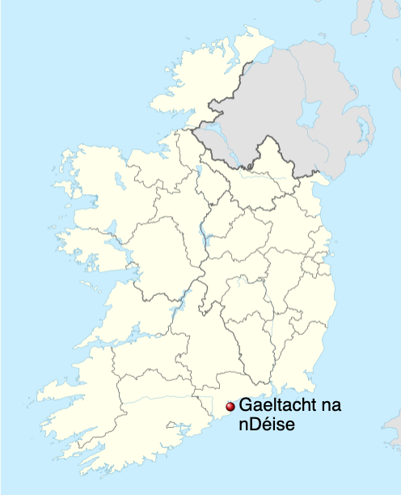

# pronunciation

## Caol and Leathan (slender and broad)

- [WTF!? Slender R in Irish / R caol EXPLAINED!](https://www.youtube.com/watch?v=Aj45ma-qh2I&ab_channel=CiaraN%C3%AD%C3%89)
- [ ] <https://www.youtube.com/watch?v=VP88uJgijfE&ab_channel=AnLoingseach>

[AnLoingseach](https://www.youtube.com/@AnLoingseach)
[The Irish Exile](https://www.youtube.com/@theirishexile2043)

## gheobhaimid

[WTF!? Waterford Irish | gheobhaidh](https://www.youtube.com/watch?v=npMJtfHJSAo&list=PLY7rlV7E68LgLo4Vrzm-B5VWPk3MKB5VH&index=9&t=15s)
other areas: "féadfaidh tú dul" (you can go - somewhere)
( Phort Láirge (Waterford) Gaeltacht: Gaeltacht na nDéise: An Ring & An Sean Phobal (Old Parish)):

- "gheobhaidh tú dul" (you can go - somewhere)
- "ní bhfaighidh mé dul" (I can't go)
- 
<https://www.deise.ie/>

- fuiriste; fuirist as variants for furasta
- casóg (as "jacket", "blazer", "blouse", etc.)
- n'fheadar ?
- dhein, níor dhein (instead of níor rinne (dependent form of déan, elsewhere))
- dh'ith /jɪ/ instead of d'ith /dɪ/
- use of word that has different meaning elsewhere:
  - airigh (normaly, for a feeling - d'airigh mé tinn - i felt sick)
  - alt. (in Ó Dónaill) "to hear" - Waterford feature in terms of frequency
  - and "dh'airigh" /ɣɔrə/ or /ɣärə/
