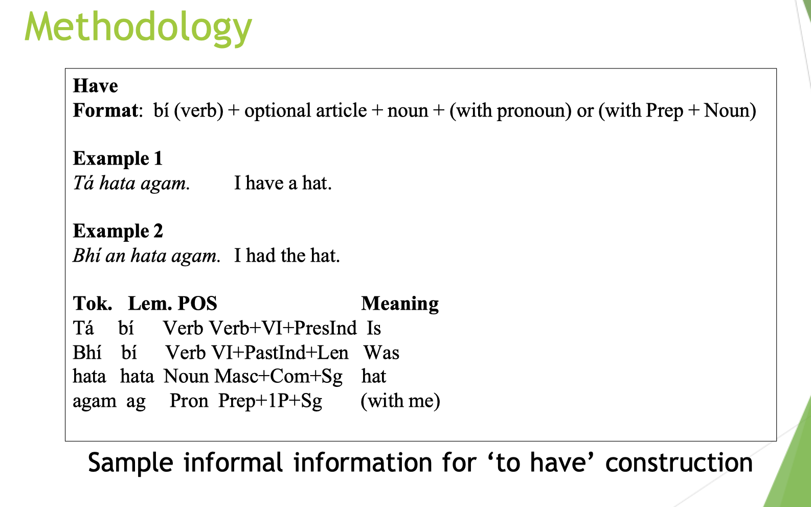

# resources

## google drive

- [Resources on shared google drive folder](https://drive.google.com/drive/folders/1xsuRNNTBvwrcTaFEMoK-QbDr-mONYupl?usp=sharing)

## dictionaries, grammar, databases

### wikibooks: irish

<https://en.wikibooks.org/wiki/Irish>

### Nualéargais (abbrevs: NL, NLG)

- <http://www.nualeargais.ie/> (Copyright 2008)
- Grammar: <http://nualeargais.ie/gnag/gram.htm>
  - An extremely thorough German book on Irish grammar, many parts of which have been translated into English. Only the translated sections are on the website.
- Java (!!) Irish-language flashcard learning program?

### Foclóir Geailge-Béarla (Irish-English Lexicon) (abbrevs: FGB)

- <https://www.teanglann.ie/en/fgb>

### Réimnigh

- <https://www.reimnigh.com/>
- full verbal paradigms
  - (each verb is on a single page, unlike FGB. includes preverbal particles and initial mutations therefrom)
  - includes common Ulster/Connacht/Munster alternatives/variants, if they exist
- verbs (limited set):
  - abair, bain, beir, bí, ceannaigh, clois, cuir, déan, deighil, fág, faigh, fan, feic, foghlaim, freagair, imir, inis, ith, léigh, maraigh, ól, oscail, rith, sábháil, tabhair, tar, téigh, tóg, tosaigh

### Wordsense

- (does not have a dedicated Irish section, but some Irish words show up on there, with more information (etymology in particular) than you might find on FGB, etc.)
- eg. <https://www.wordsense.eu/airg/>

### Dictionary of technical terms

- <https://www.tearma.ie/>

### Forvo

- pronunciation dictionary comprised of user-submitted sound recordings
- [ ] They have been making mass downloads, scraping, and searching much harder lately, so if you know of a workaround, please let me know
- <https://forvo.com/languages/ga/>

- <https://archive.org/search?query=%28language%3Agle+OR+language%3A%22Irish%22%29>
  - audio: <https://archive.org/search?query=%28language%3Agle+OR+language%3A%22Irish%22%29&and%5B%5D=mediatype%3A%22audio%22>
  - irish children's stories: <https://archive.org/search?query=%28language%3Agle+OR+language%3A%22Irish%22%29+subject%3A%22Children%27s+stories%22>
  - irish fiction: <https://archive.org/search?query=%28language%3Agle+OR+language%3A%22Irish%22%29+subject%3A%22fiction%22&and%5B%5D=language%3A%22Irish%22>

### Placenames Database of Ireland

- <https://www.logainm.ie/en/>

#### Sound Archive of the Placenames Branch

- (must register to play sound files)
- <https://www.logainm.ie/phono/>

### National Database of Irish-language Biographies

- <https://www.ainm.ie/>
- (I don't believe these have audio recordings.)

### Gaois research group

- <https://www.gaois.ie/en/>
- "develops innovative resources to support the Irish language and its heritage"
- (are themselves a hub for links to many of the other resources in this section)

### Gaeilge.ie: "The network for our language" (?)

- <https://www.gaeilge.ie/>

### CELT: Corpus of Electronic Texts

- <https://celt.ucc.ie/>
- "The Free Digital Humanities Resource for Irish history, literature and politics."
- "ELT is a searchable online corpus of multilingual texts of Irish literature and history with over 19 million words available, and growing." (Last website copyright is 2021)
- original texts and (some) translations (some translations are modern)
  - originals: <https://celt.ucc.ie/irlpage.html>
  - translations: <https://celt.ucc.ie/transpage.html>

### Tobar na Gaedhilge

- <https://www3.smo.uhi.ac.uk/oduibhin/tobar/>
- (You need to download an old-ass Windows program to search the database, which is ostensibly to prevent users from extracting copyrighted texts.)
- "a searchable textbase of high-quality 20th-century Gaelic texts (mostly Irish, with some Scottish)"

### National Corpus of Ireland

- <https://www.corpas.ie/en/>
- "An initiative to develop a large national corpus of contemporary Irish encompassing both written and spoken sources."
- "The corpus contents will be accessible on this website, and users will be able to search the corpora and download data generated during the project."
- (this corpus is linked to from other sites listed here, but they use antiquated links)
- [ ] How does one actually use it?
- "Introducing the National Corpus of Ireland Project"
  - <https://aclanthology.org/2022.cltw-1.14.pdf>

### New Corpus for Ireland

- user's guide
  - <https://www.sketchengine.eu/the-new-corpus-for-ireland/>
- "The New Corpus for Ireland is a large collection of texts in Irish with approximately 30 million words. It contains a wide range of texts including works of fiction, factual texts, news reports, official documents and much more. The corpus is designed to be used for linguistic research"

### Foras na Gaeilge

#### Scríobh Leabhar program: books written by students

- <https://www.forasnagaeilge.ie/scriobhleabhar/the-books/?lang=en>

#### An Gúm ("The Scheme"?) angum.ie (Foras na Gaeilge subsidiary?)

- "provides publications and resources which support education through Irish and the use of Irish in general."

1. [An Gúm House Style Guide (in Irish)](https://www.forasnagaeilge.ie/angum/wp-content/uploads/sites/5/2020/09/8170781c7c681564e2d94e29da3681ce.pdf)
2. [Translator Guidelines (in Irish)](https://www.forasnagaeilge.ie/angum/wp-content/uploads/sites/5/2020/09/Treoracha-dAistritheoiri.pdf)
3. [Christian Brothers' Irish Language Grammar (in Irish)](https://www.forasnagaeilge.ie/angum/wp-content/uploads/sites/5/2020/09/GGBC_19990-2.pdf)

#### Foras na Gaeilge soundcloud

- <https://soundcloud.com/forasnagaeilge>
  - Soundcloud playlist of children's books read aloud
    - <https://soundcloud.com/forasnagaeilge/sets/an-gum-1>
  - Ceacht (lessons) of some kind?
    - <https://soundcloud.com/forasnagaeilge/ceacht-193>

#### Foclóir Póca Irish Dictionary Pronunciation Guide

- <https://www.forasnagaeilge.ie/angum/pronunciation-guide/?lang=en>
  - All these on soundcloud: <https://soundcloud.com/forasnagaeilge/sets/focloir-poca-treoir-foghraiochta>

1. [Pronunciation Guide Booklet](https://www.forasnagaeilge.ie/angum/wp-content/uploads/sites/5/2020/09/Pronunciation-Guide-Booklet.pdf)
2. [Introduction](https://www.forasnagaeilge.ie/angum/wp-content/uploads/sites/5/2020/09/28487346609b1292d6164c18ac68e019-1.mp3)
3. [Vowels](https://www.forasnagaeilge.ie/angum/wp-content/uploads/sites/5/2020/09/fed346f002e98d7857bdb8e7c0b51540.mp3)
4. [Consonants](https://www.forasnagaeilge.ie/angum/wp-content/uploads/sites/5/2020/09/247319804a5891ef4d4d6b6317739d43.mp3)
5. [Séimhiú and Urú](https://www.forasnagaeilge.ie/angum/wp-content/uploads/sites/5/2020/09/69f5672ab6fdfb284e544c01c95539a7.mp3)
6. [Stress](https://www.forasnagaeilge.ie/angum/wp-content/uploads/sites/5/2020/09/daaa38e2f2923ace57395c5a6ef823a4.mp3)

#### Croidhe Cainnte Ciarraighe

- "The great lexicographical work done by Seán Óg Ó Caomhánháin, Seán a'Cóta, in the thirties and forties of the last century, a work he entitled Croidhe Cainnte Ciarraighe"
- <https://www.forasnagaeilge.ie/angum/croidhe-cainnte-ciarraighe/?lang=en>
- [Téacs an tSaothair](https://www.forasnagaeilge.ie/angum/wp-content/uploads/sites/5/2020/09/8fddae92ae307b022d964ebe73d45df6.pdf)
  - 4,000 page dictionary, in Irish. Public Domain pdf.
- [Nóta Mínithe](https://www.forasnagaeilge.ie/angum/wp-content/uploads/sites/5/2020/09/a28dc8b7c74010adaa77704a0351ea33-1.docx)

### Gaschaint

- <https://www.gaschaint.ie/>
- "A website of 2000 phrases, together with recordings, for parents who wish their children to grow up able to speak Irish. The three main Irish dialects are represented on the website, which is colour-coded for ease of use. All recordings are by native Irish speakers."
- Completely free. (You can buy the book to support them?)

### The Dúchas Project

- dúchas.ie

#### National Folklore Collection (NFC)

- digitization of the National Folklore Collection (NFC)
  - audio collection: <https://www.duchas.ie/en/cbef/recordings>
    - (no transcriptions)

#### Bailiúchán na Scol (The Schools Collection)

- "This is a collection of folklore compiled by schoolchildren in Ireland in the 1930s."
- Irish-language texts: <https://www.duchas.ie/en/cbes/stories?Page=1&LanguageID=ga&PerPage=20>

### An Chomhairle um Oideachas Gaeltachta & Gaelscolaíochta (COGG)

- <https://www.cogg.ie/en/>
- "The Council for Gaeltacht Education & Gaelscholaíochta"
- [Resource database](https://www.cogg.ie/en/resource-database/#?keywords=&subject=&types=&levels=&page=1&language=en)
- classroom posters clarifying common Irish-language mistakes:
  - <https://www.tairseachcogg.ie/Home/ResourceDetails?_HYtIf125x=xgJpgGdAkt8YHRhpSatKS1vupeJczgO4APCgYA9lX3HVVb91eiNznansojzdha7B&XdfuUilwqFJdhFHgfJg_JhhghayWeRp=lwqFJdh>

#### Gaelchultúr Teoranta

##### Fís agus Foghlaim

- short (3-4 minute) Irish grammar (etc) lessons (in Irish)
- youtube playlist: <https://www.youtube.com/playlist?list=PL7wLVDMegS1RwEu_jnVOPwtl1UVSLdKpH>

### Meoneile.ie

<https://www.meoneile.ie/>

### tuairisc.ie

- <https://tuairisc.ie/category/foghlaimeoiri/>
- (Their Irish videos have Irish-languae subtitles sometimes):
  - eg. <https://tuairisc.ie/fisean-ar-fhaitios-gur-chaill-tu-e-cuid-de-scealta-tuairisc-an-tseachtain-seo/>
  - <https://tuairisc.ie/fisean-snamh-an-tsunda-aistear-farraige-o-oilean-go-hoilean-eile-deanta-ag-altra-gaeltachta/>
  - <https://tuairisc.ie/ceard-is-bri-le-no-cap-agus-cen-ghaeilge-ata-air-gaelingo-sraith-nua-le-tuairisc/>
  - [ ] Do all their youtube channel videos have Irish CC? <https://www.youtube.com/@TuairiscIenuacht/videos>

### Trinity College Dublin (TCD)

- <https://www.tcd.ie/slscs/clcs/psl/>
- Irish & Celtic studies resources page:
  - <https://libguides.tcd.ie/c.php?g=668577&p=4743906>

#### School of Computer Science and Statistics (SCSS)

- Natural language processing tools: <https://www.scss.tcd.ie/~uidhonne/irish.utf8.htm>
  - morphological tags: <https://www.scss.tcd.ie/~uidhonne/morphtag.htm>
  - dependency analysis tags: <https://www.scss.tcd.ie/~uidhonne/deptag.htm>
  - morphosyntactic tag set: <https://www.scss.tcd.ie/~uidhonne/parole.htm>
  - constraint grammer info: <https://visl.sdu.dk/constraint_grammar.html>
- (i) Generated full word paradigm (all declensions, conjugations, etc); (ii) look up in An Foclóir Póca
  - <https://www.scss.tcd.ie/~uidhonne/lookup.utf8.htm>

#### School of Linguistic, Speech and Communication Sciences (SLSCS)

- <https://www.tcd.ie/slscs/research/projects/past/prosody.php>
- Online corpus of spoken irish
  - <https://www.scss.tcd.ie/~uidhonne/comhra/index.utf8.html>
  - recordings with literal (?) transcriptions (includes filler words). multiple speakers. conversations. link to SLSCS gloss of contractions, slang, dialectical pronunciations, etc. used by speakers.
- "Prosody of Irish Dialects" (research article)
  - <https://www.tcd.ie/slscs/research/projects/past/prosody.php>
- SCSS's own resources links page
  - <https://www.tcd.ie/slscs/itut/index.php>

#### abair.ie - TCD's Phonetics and Speech Laboratory website

- (not sure why there's a "dev" version of the site:) <https://dev.abair.ie/en>
- the newer version, I guess: <https://www.abair.ie/>
  - <https://www.abair.ie/speech-recognition>
  - (applications)
    - <https://www.abair.ie/applications>
      - <https://scealai.abair.ie/>
- (i wonder how to just get the recordings: ) <https://phoneticsrv3.lcs.tcd.ie/studio/en/recorder/>
  - part-of-speech tagging: <http://www.abair.tcd.ie/index.php?page=partofspeech&lang=eng>
    - <https://www.scss.tcd.ie/~uidhonne/pos_gle.utf8.html>
- generated audio of proverbs: <https://www.abair.tcd.ie/index.php?page=proverbs&lang=eng>
- generated audio of short stories, news, numbers, and greetings: <http://www.abair.tcd.ie/index.php?page=learners&lang=eng>

##### CabairE

- "CabairE is a literacy aid for Irish that helps you to master Irish spelling"
- "CabairE reads out text in Irish - either Donegal, Connemara or Kerry Irish - and highlights each sentence and word as it goes along."
- (Reading is done by a Text To Speech program.)
- <http://www.abair.tcd.ie/cabaire/eolas.php?lang=eng>

##### An Scéalaí**

- Language-learning application (The Storyteller). Essentially a word processor that provides grammar and spelling checks, computer-generated Text to Speech (TTS), and dictionary word searches.
- <https://scealai.abair.ie/#/landing>
- <https://scealai.abair.ie/#/prompts/pos>

##### Bat Mírialta** [*Does not work - there's some bug with the program.*]

- A game hosted by a cartoon robot which presents sentences with blanks which are to be filled with conjugated irregular verbs.
- <https://bat-mirialta.detail-design-develop.com/applications/bat-mirialta/>

### non-fiction books

#### Leabhar mór bhriathra na Gaeilge = The great Irish verb book. Author: Art J. Hughes

- (Worldcat entry) <https://www.worldcat.org/title/318545786?oclcNum=318545786>

#### more

- (NSII) Stenson, Nancy. Intermediate Irish. 2008 (Routledge)
  - may also appear as  (Stenson-II), (Stenson 2008)
- (NSBI) Stenson, Nancy. Basic Irish
- (NSMI) Stenson, Nancy. Modern Irish.
- (MOSMI) Ó'Siadhail, Michael. Modern Irish: Grammatical structure and dialectical variation
- (NMIGB) MacCongail, Nollaig. Irish Grammar Book.
- (uis) Stanson, Nancy and Hickey, Tina. Understanding Irish Spelling.

## media

### computer assisted language learning (CALL)

also called:

- digital educational games (DEG)
- digital game-based language learning (DGBLL)
- game-based language learning (GBLL)

#### games

*Some games are listed under their parent company ("**máthairchuideachta**" ?) or website in other sections.*

- Fochlach (Irish-language Wordle)
  - <https://www.foclach.com/>
- Wordbricks Online (Irish)
  - (Windows) <https://apkcombo.com/wordbricks-online-irish/mprain.wordbricks/>
  - (This was the subject of a few academic articles)
- cipher: faoi gheasa
  - <https://www.youtube.com/watch?v=rsGXZz8CJ9g&ab_channel=GamesandNLP>

#### freemium apps; online programs

- duolingo
- buso
- memrise
- babble
- rosetta stone (library access)
- WordBricks (see above?)
- [Transparent Language](https://education.transparent.com/mylearning/game/)

### fiction

*Grouped by author when applicable.*

#### Ní Ghlinn, Áine

##### Hata zú Mhamó (hzm)

- (google drive) <https://drive.google.com/file/d/1LmBOkOBXs6LIKvzua8OMD9cYS8Wtafd3/view?usp=drive_link>
- (free audiobook) <https://soundcloud.com/cois-life-teoranta/sets/hata-zu-mhamo>
  - 3 tracks, ~ 1 hour

##### Thar an Trasnan

- (free to borrow) <https://archive.org/details/thartrasnan0000nigh>
- (no audiobook)

##### Glantachan Earraigh

- (free to borrow) <https://archive.org/details/glantachanearrai0000nigh/page/n3/mode/2up>
- (no audiobook)

#### Nic Phaidin, Michelle

##### An tIriseoir ("The journalist")

- (free to borrow) <https://archive.org/details/tiriseoir0000nicp>
- (free audiobook) <https://soundcloud.com/cois-life-teoranta/sets/an-tiriseoir>

#### Ó Muirthile, Liam

##### Aois Fir

##### Oilithreach Pinn

- (free to borrow) <https://archive.org/details/oilithreachpinn0000omui>
- (free audiobook) <https://soundcloud.com/cois-life-teoranta/sets/liam-o-muirthile-oilithreach-pinn>
  - 13 tracks, ~6 hours

##### Gaothán

- (text: free to borrow) archive.org
- (audiobook: see google drive)

#### O'Brien, Flann

##### An beal bocht

- his Irish language novel written under pen name "Myles na gCopaleen"
  - <https://archive.org/details/balbochtnmillena0000obri>
  - a viscerally depressing cartoon adaptation, I believe?: <https://archive.org/details/AnBealBocht2018>

#### Ó Raghallaigh, Colmán

- Bunoscionn le Ruairí!
  - <https://archive.org/details/bunoscionnleruai0000orag> (free to borrow)

### radio

#### Irish Radio Live

- <https://irishradiolive.com/>
  - <https://irishradiolive.com/raidio-na-gaeltachta>

#### RTE

- <https://www.rte.ie/radio>

#### Raidió na Life

- "Irish language community radio station based in Dublin."
- <https://www.raidionalife.ie/en/>  
- <https://soundcloud.com/rnl>
  - playlists: <https://soundcloud.com/rnl/sets>
- *eolas at raidionalife dot ie*
- Closleabhair (**closleabhair** = "audiobooks") <https://soundcloud.com/rnl/sets/leabhar-do-phaist>
  - "A collection of over 50 children’s books recorded by Raidió na Life and made available free as podcasts to help young readers and their parents."
  - These sound files are all still here (50 tracks totally just under 3 hours)
  - [ ] Links to text of books.

##### What the Focal!? <https://soundcloud.com/rnl/sets/what-the-focal-le-ciara-ni-e>

- In Irish
- Youtube playlist: <https://www.youtube.com/watch?v=l7UxLu5opoY&list=PLY7rlV7E68LgLo4Vrzm-B5VWPk3MKB5VH&ab_channel=CiaraN%C3%AD%C3%89>

### Leabhair Ghaeilge ó Chló Mhaigh Eo

- Irish Language Books from Cló Mhaigh Eo
- <https://www.leabhar.com/>
- comics: <https://www.leabhar.com/comics.html>
- purchasable audio cds: <https://www.leabhar.com/cdrom.html>

### Literature Ireland

- <https://www.literatureireland.com/>
- <https://www.literatureireland.com/books/>
- <https://www.literatureireland.com/books/talking-translations-podcast/>

### Leighleat

- <https://www.leighleat.com/>
- Stories by age-group, with text and audio
  - <https://www.leighleat.com/sc%C3%A9alta>
- Poetry, with text and audio
  - <https://www.leighleat.com/d%C3%A1nta>
- Lessons and games
  - <https://www.leighleat.com/ceachtanna>
- Music, some without any lyrics
  - <https://www.leighleat.com/ceol>
- Nature information and quizzes
  - <https://www.leighleat.com/n%C3%A1d%C3%BAr>
  - The words in the essays and informational sections can be clicked on, and show a translation in an HTML tooltip
  - Audio appears to be nature sounds (eg. bird tweets) rather than someone reading the information aloud
- Newsletter <https://www.leighleat.com/nuacht>

### Séideán Sí

- <http://www.seideansi.ie>
- "an integrated programme for teaching Irish in Gaeltacht and all-Irish Primary schools, published by An Gúm and the Department of Education, includes readers, workbooks, teacher’s manuals, posters, games, CDs as well as interactive support materials available online."
- **This site is entirely in Irish**, and I don't see an English/Béarla button. If you use translate.google.com, all the buttons to the games don't work, so you have to switch back and forth.

#### about ??

- <https://www.tandfonline.com/doi/full/10.1080/01434632.2021.1955893>

---

## fonts

- (TrueType | Freeware) [*Warning: may be corrupted*]
  - <https://fonts2u.com/clo-gaelach-twomey.font>
- Kells Sd
  - <https://www.dafont.com/kells-sd.font>

## broke-ass links to resources

- Subh.ie <http://subh.ie>
  - Ostensibly containing "videos, computer games, flashcards and other teaching and learning resources", it appears to be a blog with 5 entries last updated in 2020.
- An tÁisaonad. Túsfhuaimeanna– downloadable booklets to teach sounds in Irish. Range of materials available for download. <http://www.stmarys-belfast.ac.uk/aisaonad/>
- BELB (Belfast Education and Library Board)/An tÁisaonad. (2011). Fónaic na Gaeilge, Eolas Fóineolaíoch Comprehensive Phonics materials for teachers and pupils, can be downloaded free/Ar fáil ar líne ag: <http://www.stmarys-> belfast.ac.uk/aisaonad/Fonaic/Fonaic_na_Gaeilge.html
- <http://www.arts.ulst.ac.uk/lanlit/irish/research/projects/edil.html>

## ??

### Finite State Morphological Analyser

- Uí Dhonnchadha (2002)
- A great, accurate, high quality resource

### Parser and Treebank

- Lynn (2016)
- A great, accurate, high quality resource
- No need to reinvent the wheel

### some ppt presentation

## other people's resource lists

- <https://gratisglobal.com/learn-irish-free/#apps>
- <https://toingaeilge.com/acmhainni>

- corkirish.wordpress.com
  - <https://corkirish.wordpress.com/audio-files-on-this-site/>
  - <https://archive.org/details/MoSgealFein>
    - "A recording of all 32 chapters of Mo Sgeal Fein by Peadar Ua Laoghaire. The recording was done by Maighread Bean Ui Lionaird in the Cork Gaeltacht"

- <https://fonaicnagaeilge.com>
- The Séideán Sí series is an integrated programme for teaching Irish, with DVD and on line support, which was developed for Gaeltacht and all-Irish schools.
- <http://www.stmarys-> belfast.ac.uk/aisaonad/Fonaic/Fonaic_na_Gaeilge.html
- Muintearas also offer a series of workbooks. <http://www.muintearas.com/leabhar.htm>
- Many other support materials, including pictures, posters, and games to accompany the phonics programme, as well as a second phonics programme that builds on Fónaic na Gaeilge are available under the Gaeloideachas link at <http://www.nicurriculum.org> .uk/.
- <https://www.youtube.com/watch?v=mBoX_JCKZTE>
- <https://www.stmarys-belfast.ac.uk/academic/aisaonad/default.asp>
- An tÁisaonad offers a range of materials free <http://www.stmarys-belfast.ac.uk/aisaonad/> Túsfhuaimeanna is a set of downloadable booklets to teach sounds.
- <https://www.leighleat.com/#failte>
- list of resources: <https://libguides.tcd.ie/c.php?g=668577&p=4743906>
- soundcloud audiobooks (closleabhar)
  - <https://soundcloud.com/search?q=closleabhar>

## Lexiconista

- <https://www.lexiconista.com/>

### online forums, newsgroups (?), etc

### Urscealta ("novels")

- <https://groups.io/g/urscealta>
- <urscealta at groups dot io>
- A group for intermediate students of Irish who would like a forum to translate and discuss novels that were specifically written for adult learners.and also other Irish literature.
  - eg. Questions about *Gaothán*: <https://groups.io/g/urscealta/topic/14725809#1703>
